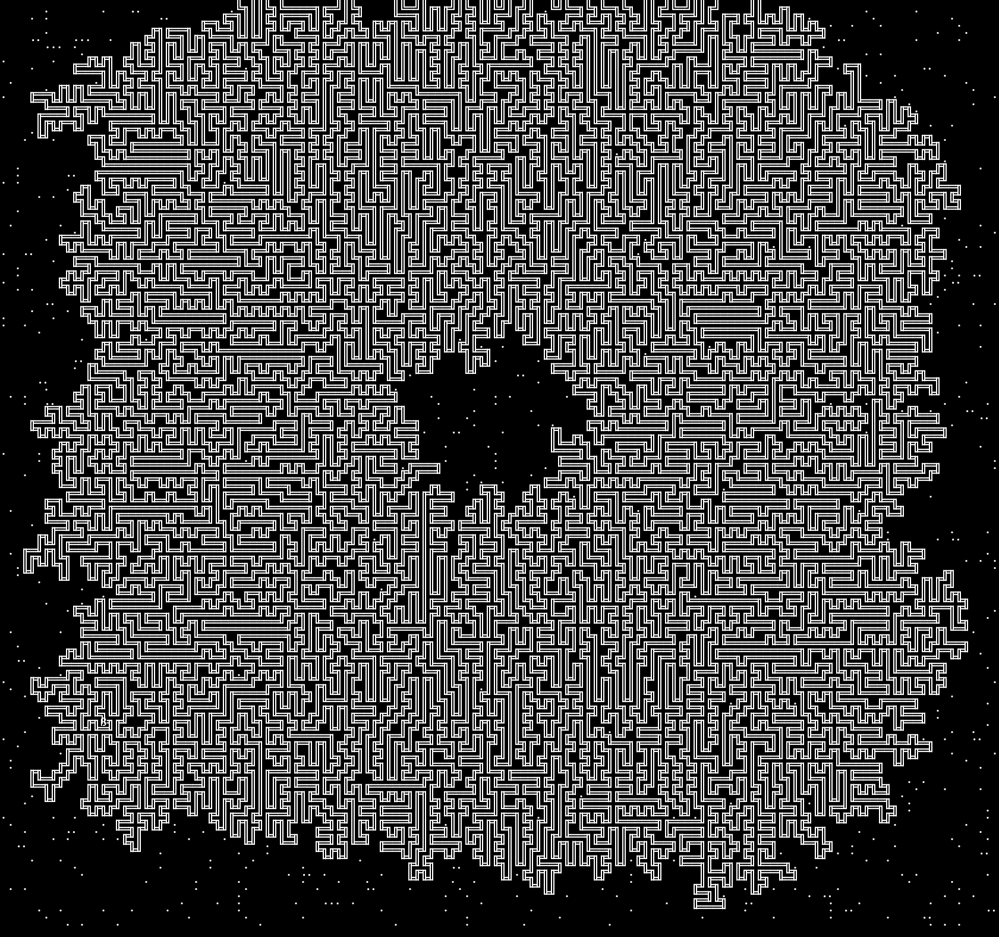
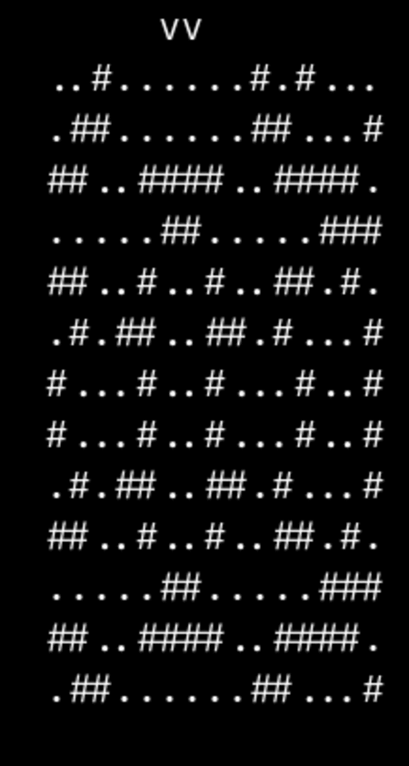

# day 5

almanac
seeds: by numbers

relationships between categories, as lines of 3 numbers
- seed-to-soil
- soil-to-fertilzed
- etc...

mapping
- src/dst/range
- 404 unmapped ones, map to the same number
- 1 to 1

## silver

problem
find the lowest location number
that corresponds to any of the initial seeds

test = 35

## gold

seeds are actually a *range*, determined by PAIR of numbers (start,length)

# day 6

boat race

you travel with your boat in the given times

- get a list of **times** for each **race** in milliseconds
- get a list of best distances for each race in millimetros

you need to go farther than the best distances to win

toy boats, charged by pressing a button while stopped 1ms = 1ml/ms
they go faster the longer it was pressed

can only push the button at the beggining of the race

PROBLEM: multiply(count_of_ways_to_win) = 288

# day 7 Camel Cards

similar to poker

input
- list of hands of 5 cards
- a bid

card strengh
- A, K, Q, J, T, 9, 8, 7, 6, 5, 4, 3, or 2.

hand strength
- five of a kind  (5 equal)
- four of a kind  (4 equal)
- full house      (3 equal and 2 equal)
- three of a kind (3 equal and 2 different random not equal)
- two pair        (2 equal and 2 equal)
- one pair        (2 equal and 3 different random not equal)
- high card       (all different)

ordering
- by hand strength
- by each card on each hand (1 with 1, 2 with 2...)
  - if different hand with the strongest first card is stronger
  - if equal continue


rank = order of the hand, 1 is weakest

goal (total winnings)
- order the hands
- multiply the bid by the rank (starting at 1)
- sum = 6440

## gold

J is a comodin now for hand_strength
but the weakest in card comparisons

goal winnings (same) = 5905

# --- Day 09: Mirage Maintenance ---

- in an _oasis_

- your INPUT
  - list of values (positive/negative)
  - each line is a different value
  - each value on a line is a change of that value

- steps
  1. calculate the difference between all numebrs
  2. if all /= 0
     3. continue using this smaller sequence as the input do (1)
     3. else add a new value to the zeroes and fill the inverse pyramid
        with values equal to the number_below+number_left
        the final numbers is the _prediction_ of that value

- output: the sum of all predicted value
# --- Day 10: Pipe Maze ---

- Gauss's magic shoelace area formula and its calculus companion
  https://www.youtube.com/watch?v=0KjG8Pg6LGk

- Pick's theorem: The wrong, amazing proof
  https://www.youtube.com/watch?v=uh-yRNqLpOg&t=76s

- Topology: Jordan's Curve Theorem
  https://www.youtube.com/watch?v=hnds9-GmwkM



# --- Day 11: Cosmic Expansion ---

sum of lengths of shortests paths between galaxies
- using manhattan distance (no diagonals)
- only count the pairs ONCE

account for universe expansion
  - any row/column that contains no galaxies should be twice as big
  - makes the columns thicked

number the galaxies starting from 1
  - from leftTOright and upTOdown

Example: 9 galaxes, 36 pairs, shortest paths sum = 374

# --- Day 12: Hot Springs ---

# --- Day 13: Point of Incidence ---
each pattern has 1(one) reflective axis
result = add
- number of cols to the left of vertical reflection
- 100 * number of rows above of horizontal reflectio



# --- Day 14: Parabolic Reflector Dish ---


<a href="https://media.githubusercontent.com/media/azimut/challenges/master/adventofcode/23/day14vispart1.mp4"></a>

# --- Day 15: Lens Library ---

Part 1

 Hash = string -> number[0-255]
 - start at 0
 - increase it by ascii char
 - *= 17
 - %= 256

 Sum hashes of each group of letters

Part 2

 each BOX has LENS slots
 boxes             = [0-255]
 lens have LABELS
 - hash(label)  = box nr they belong
 lens FOCAL LENGTH = [1-9]
 input STEPS are a label+operation
 operation:
 (=FL) replace it with the new one (with new focal lenght) if existed
       or just add it "behind" the other lenses (not moving them)
   (-) remove lens with label from hash(label) box
       shrink lenses, do not leave empty spaces

 sum of focusing power of each LENS
 multiply
 - (1+) box nr where is it
 - nr of slot ([1-]) where is it
 - his focal length
# --- Day 16: The Floor Will Be Lava ---

 light enters on the top-left corner
 - in RIGHT direction

 On
 - empty space, keeps direction

 - mirror /\, gets reflected 90°
   - right ray / changes direction upwards, from mirror
   - rigth raw \ changes direction dowards, from mirror

 - splitter |-
   - pointy side, does nothing, like empty space
   - flat side, splits into 2 rays, in the split direction

 how many ENERGIZED tiles are (aka a beam passes through)

# --- Day 17: Clumsy Crucible ---


- Dijkstra's Algorithm - Computerphile
  https://www.youtube.com/watch?v=GazC3A4OQTE
# --- Day 18: Lavaduct Lagoon ---

<p float="left">
  
  
</p>

input: dig plan
- start 1 cubic meter into the ground
- then  1 cubic meter into the ULDR direction

part 1 - area of draw area based on instructions

part 2 - decode from the "hexcode" a direction/distance

result positions ranges
x = [0..1_186_328]
y = [0..1_186_328]

x = [-3_375_035..10_344_944]
y = [-16_526_864..2_399_363]

distances = [332..654246]
# --- Day 19: Aplenty ---

a pile of **parts** is classified in, with a value associated to each and 1 or more of these
- x: extremely cool
- m: musical
- a: aerodinamic
- s: shiny

each parts goes through a **workflows** to ultimately accept it or reject it

each workflow has a list of **rules**

some rules a **condition** and a **place** to send it
some rules are either **R** or **A**, to immediately reject or accept

part 1

start from workflow "in", sum the ratings (xmas) of all the ACCEPTED parts

part 2

how many combinations of ratings, from 1-4000 can pass through the workflows

167409079868000
167_409_079_868_000

# --- Day 20: Pulse Propagation ---

machine/cables/communication modules(relay)/pulses(high/low)/destination modules

pulses are proceed in the order they are sent
- before process the NEW pulses, you have to process the send first

some sequence might repeat

## type of modules (%&bb)

- % flip-flop (off/on)
  - flips on low pulses **only**
  - when flipped outputs:
    - HIGH when off -> on
    - LOW when  on  -> off

- & conjunction
  - remembers most recent type of pulse received
  - default to low-pulse before receiving anything from that module
  - if ALL of if memory is HIGH, outputs LOW, otherwise outputs HIGH

- broadcast
  - whatever it receives it sends it back

- button
  - pressed **once** at the start
  - sends LOW to broadcaster
  - not pressed again until, processing of pulses is done

- untyped
  - for testing?
  - no outputs?

## part 1

 - given a how times you pushed the "button"
 - what is the result of multiplying the number of low by high pulses sent

## part 2

```
("pl" 3796 3796)
("zm" 3822   26)
("mz" 3880   58)
("lz" 4002  122) x2

("pl" 7593 3591)
("zm" 7645   52)
("mz" 7761  116)
("lz" 8005  244) x2

("pl" 11390 3385) >>> 3591-3385 = 206 >> 11390-7593 = 3797
("zm" 11468   78)
("mz" 11642  174)
("lz" 12008  366) x2

("pl" 15187 3179) >>> 3385-3179 = 206 >> 15187-11390 = 3797
("zm" 15291  104)
("mz" 15523  232)
("lz" 16011  488) >>> 16011-12008 = 4003
```

LCM (3795 3821 3879 4001)
225514321828633 !!!

```
INPUT OF "bn", which sends to "rx", all need to be HIGH at the same time
"lz" = :LOW [remove entry]
"mz" = :LOW [remove entry]
"pl" = :LOW [remove entry]
"zm" = :LOW [remove entry]

LCM = 240,424,460,542,695 HIGH
LCM = 225,514,321,828,633
LCM =  75,016,343,938,635 LOW
LCM =     361,028,183,880 LOW

240424460542695 TOO HIGH
 75016343938635 TOO LOW
   361028183880 TOO LOW

```

# --- Day 21: Step Counter ---

steps/map/garden plot(.)/rocks(#)/starting position (S)/tile/NSEW

remaining 64 steps
starting position is a plot

first step

# --- Day 22: Sand Slabs ---

sand/bricsofsand/disintigrated/freelyflowingsand/topple/snapshot/falling brigs/made of cube

coordinates
- x and y are horizontal coordinates
- z=0 is the ground

input (each line)
- the position of a single brick (xyz)
- 2 coordinates, one for each end of the brick
- all coordinates above the ground (no negative)
- still falling


bricks
- made of a single straight line of cubes
- lowest z is 1
- never rotate
  
## part 1

after they fall,
which bricks are CAN be desintigrated (not at the same time)
aka are not supporting other bricks OR is not alone supporting other brick

example = 5
# --- Day 23: A Long Walk ---

<video src="https://private-user-images.githubusercontent.com/2867036/292656762-5f365896-13a1-4d3f-bd88-7e44c74aa4de.mp4" width="500"/>

map/hikingtrails/(.)paths/(#)forest/(^>v<)steepslopes(icy)/downhill/tile/row/start/goal/scenichike

- start from the single path tile on the top row
- goal single path tile at the bottom row
- stepping int a slope, next tile must be on that direction
- never step on the same tile twice

## part 1

longes hike you can take?

test = 94
